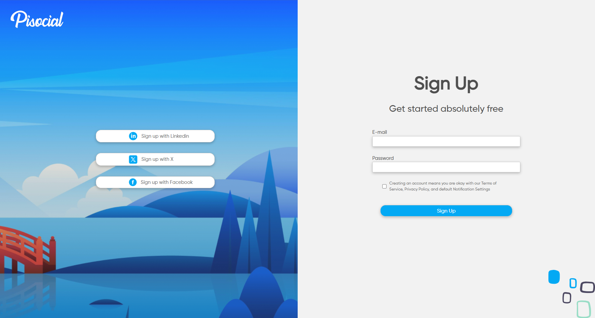

# Estudos React

Este repositório contém vários projetos de estudo em React, cada um com diferentes funcionalidades e tecnologias. Abaixo está uma descrição de cada projeto e as tecnologias utilizadas.

## Projetos

### 1. Página de Cadastro (_signup-page-react_)

Este projeto é uma página de cadastro simples construída com React e Vite. Inclui um formulário para registro de usuários e opções para se cadastrar usando redes sociais.

#### Funcionalidades

- Formulário de cadastro de usuários.
- Opções para cadastro via redes sociais (LinkedIn, Twitter, Facebook).
- Design responsivo para visualizações em dispositivos móveis e desktop.

#### Tecnologias Utilizadas

- **React**: Biblioteca JavaScript para construção de interfaces de usuário.
- **Vite**: Ferramenta de build rápida para projetos front-end.

#### Estrutura do Projeto

- `src/components/Form.jsx`: Contém o componente de formulário para registro de usuários.
- `src/components/SocialNetwork.jsx`: Contém o componente para opções de cadastro via redes sociais.
- `src/App.jsx`: O componente principal que combina os componentes de formulário e redes sociais.
- `src/App.css`: Estilos para o componente principal.
- `src/components/Form.css`: Estilos para o componente de formulário.
- `src/components/SocialNetwork.css`: Estilos para o componente de redes sociais.

### 2. Gerenciador de Tarefas (_task-list-react_)

Este é um projeto de gerenciador de tarefas (CRUD) desenvolvido com React e Vite. Ele permite adicionar, visualizar, editar e excluir tarefas, além de marcar tarefas como concluídas.

#### Funcionalidades

- Adicionar novas tarefas com título e descrição.
- Visualizar a lista de tarefas.
- Marcar tarefas como concluídas.
- Excluir tarefas.
- Visualizar detalhes de uma tarefa específica.

#### Tecnologias Utilizadas

- **React**: Biblioteca JavaScript para construção de interfaces de usuário.
- **Vite**: Ferramenta de build rápida para projetos front-end.
- **Tailwind CSS**: Framework de CSS para estilização.
- **React Router**: Biblioteca para roteamento em aplicações React.
- **UUID**: Biblioteca para geração de identificadores únicos.

### 3. CodeConnect (_login-page-react_)

Projeto inicial de React de uma página de login para uma rede social chamada CodeConnect, desenvolvido durante o curso de React: componentes e JSX.

#### Funcionalidades

- Página de login com imagem, formulário de e-mail e senha, títulos e textos.
- Botão para entrar na aplicação.
- Links para lembrar senha ou cadastrar.

#### Tecnologias Utilizadas

- **React**: Biblioteca JavaScript para construção de interfaces de usuário.
- **React-DOM**: Pacote que permite a integração do React com a árvore de elementos do DOM.
- **Babel**: Transpilador que converte código JavaScript moderno em versões compatíveis com navegadores mais antigos, além de permitir a interpretação de códigos JSX.
- **JSX**: Uma extensão de sintaxe para JavaScript usada no React, que permite a escrita de código HTML/XML de forma declarativa e integrada dentro do JavaScript.
- **Componentização**: Abordagem de design em que a interface de usuário é dividida em componentes reutilizáveis e independentes.
- **Props**: Dados passados de um componente pai para um componente filho no React.
- **useState**: Hook no React que permite adicionar estado a componentes funcionais.
- **Manipulação de eventos**: Ação de responder a interações do usuário, como cliques e teclas pressionadas, em aplicações web.

#### Figma

Você pode conferir o Figma da aplicação clicando [aqui](https://www.figma.com/file/SASyBm2k3IlqrO8qI1Otg1/CodeConnect-%7C-React%3A-Componentização-e-conceitos-básicos-(JSX)).

## Contato

Para mais informações, entre em contato através do email: htonioni@outlook.com
