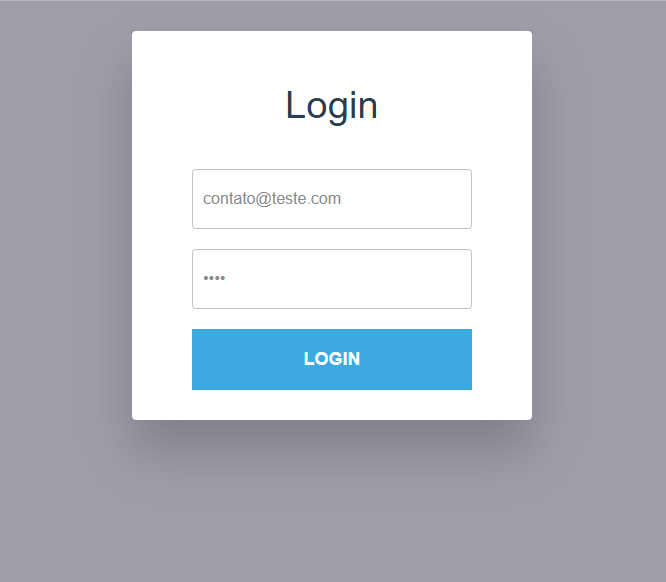

# Estudos React

Este repositório contém vários projetos de estudo em React, cada um com diferentes funcionalidades e tecnologias. Abaixo está uma descrição de cada projeto e as tecnologias utilizadas.

## Projetos

### 1. Gerenciador de Tarefas (_task-list-react_)

Este é um projeto de gerenciador de tarefas (CRUD) desenvolvido com React e Vite. Ele permite adicionar, visualizar, editar e excluir tarefas, além de marcar tarefas como concluídas.


#### Funcionalidades

- Adicionar novas tarefas com título e descrição.
- Visualizar a lista de tarefas.
- Marcar tarefas como concluídas.
- Excluir tarefas.
- Visualizar detalhes de uma tarefa específica.

#### Tecnologias Utilizadas

- **React**: Biblioteca JavaScript para construção de interfaces de usuário.
- **Vite**: Ferramenta de build rápida para projetos front-end.
- **Tailwind CSS**: Framework de CSS para estilização.
- **React Router**: Biblioteca para roteamento em aplicações React.
- **UUID**: Biblioteca para geração de identificadores únicos.

#### Instalação

Para rodar este projeto localmente, você precisará ter o Node.js e o npm instalados. Siga os passos abaixo:

1. Clone o repositório:
    ```sh
    git clone https://github.com/htonioni/Estudos-React.git
    ```

2. Navegue até o diretório do projeto:
    ```sh
    cd task-list-react
    ```

3. Instale as dependências do projeto:
    ```sh
    npm install
    ```

4. Inicie o servidor de desenvolvimento:
    ```sh
    npm run dev
    ```

### 2. CodeConnect (_login-page-react_)

Projeto inicial de React de uma página de login para uma rede social chamada CodeConnect, desenvolvido durante o curso de React: componentes e JSX.


#### Funcionalidades

- Página de login com imagem, formulário de e-mail e senha, títulos e textos.
- Botão para entrar na aplicação.
- Links para lembrar senha ou cadastrar.

#### Tecnologias Utilizadas

- **React**: Biblioteca JavaScript para construção de interfaces de usuário.
- **React-DOM**: Pacote que permite a integração do React com a árvore de elementos do DOM.
- **Babel**: Transpilador que converte código JavaScript moderno em versões compatíveis com navegadores mais antigos, além de permitir a interpretação de códigos JSX.
- **JSX**: Uma extensão de sintaxe para JavaScript usada no React, que permite a escrita de código HTML/XML de forma declarativa e integrada dentro do JavaScript.
- **Componentização**: Abordagem de design em que a interface de usuário é dividida em componentes reutilizáveis e independentes.
- **Props**: Dados passados de um componente pai para um componente filho no React.
- **useState**: Hook no React que permite adicionar estado a componentes funcionais.
- **Manipulação de eventos**: Ação de responder a interações do usuário, como cliques e teclas pressionadas, em aplicações web.

#### Figma

Você pode conferir o Figma da aplicação clicando [aqui](https://www.figma.com/file/SASyBm2k3IlqrO8qI1Otg1/CodeConnect-%7C-React%3A-Componentização-e-conceitos-básicos-(JSX)).


### 3. Projeto de Login (_second-page-react_)

Este é o meu segundo projeto em React, onde estou aprimorando minhas habilidades de desenvolvimento front-end. O projeto consiste em uma aplicação web que permite aos usuários interagir com uma interface básica de login de usuários.


#### Funcionalidades

- Interface de usuário interativa e responsiva.
- Componentes reutilizáveis.
- Gerenciamento de estado eficiente.
- Integração com APIs externas.

#### Tecnologias Utilizadas

- **React**: Biblioteca JavaScript para construção de interfaces de usuário.
- **JavaScript**: Linguagem de programação utilizada para desenvolver a lógica da aplicação.
- **HTML**: Linguagem de marcação utilizada para estruturar o conteúdo da aplicação.
- **CSS**: Linguagem de estilo utilizada para estilizar a aplicação.
- **Node.js**: Ambiente de execução JavaScript utilizado para o desenvolvimento do back-end.
- **Webpack**: Ferramenta de empacotamento de módulos JavaScript.
- **Babel**: Transpilador JavaScript utilizado para compatibilidade com diferentes navegadores.


## Contato

Para mais informações, entre em contato através do email: htonioni@outlook.com
