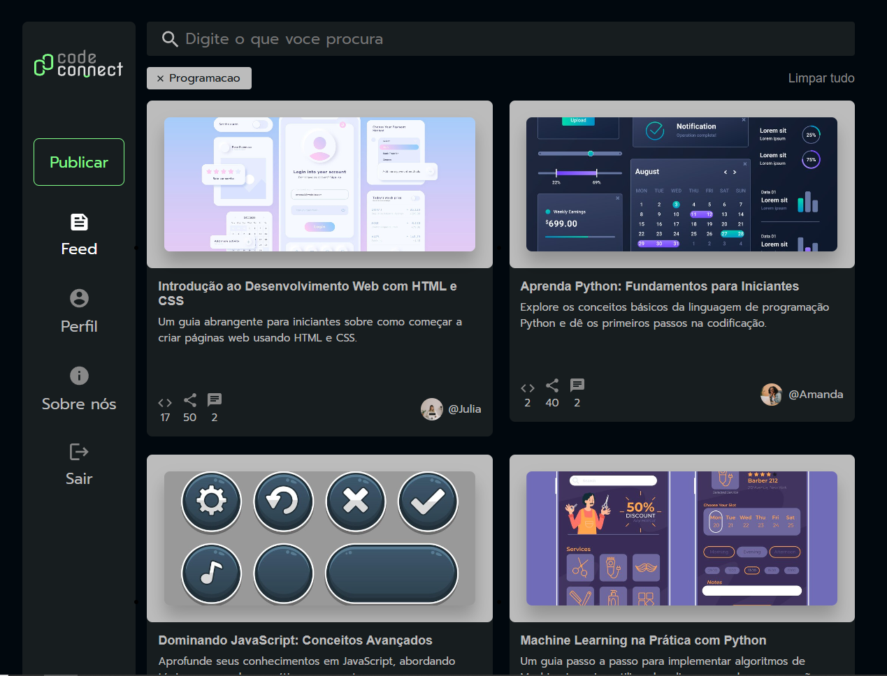

# Feed de Conteúdo com React



## Visão Geral do Projeto

Este projeto é uma aplicação de feed de conteúdo construída com React. Ele demonstra o uso de recursos modernos do React, gerenciamento de estado e arquitetura baseada em componentes para criar uma interface de usuário dinâmica e responsiva.

## Funcionalidades

- Exibir uma lista de itens do feed.
- Adicionar novos itens ao feed.
- Editar itens existentes do feed.
- Excluir itens do feed.
- Design responsivo para visualizações em dispositivos móveis e desktop.

## Tecnologias Utilizadas

- **React**: Uma biblioteca JavaScript para construção de interfaces de usuário.
- **Vite**: Uma ferramenta de build rápida e servidor de desenvolvimento.

### Integração com API

Este projeto faz uma integração com uma API para obter os dados dos itens do feed. A integração é feita utilizando a função `fetch` do JavaScript para realizar requisições HTTP.

### Hooks do React

Foram utilizados os hooks `useState` e `useEffect` do React para gerenciar o estado e os efeitos colaterais na aplicação.

- **useState**: Utilizado para criar e gerenciar o estado dos dados do feed.
- **useEffect**: Utilizado para realizar a requisição à API quando o componente é montado.

## Começando

### Pré-requisitos

- Node.js (>=14.0.0)
- npm (>=6.0.0) ou yarn (>=1.22.0)

### Instalação

1. Clone o repositório:
    ```sh
    git clone https://github.com/seu-usuario/seu-repositorio.git
    ```
2. Navegue até o diretório do projeto:
    ```sh
    cd seu-repositorio
    ```
3. Instale as dependências:
    ```sh
    npm install
    ```
4. Iniciar o servidor  
    ```sh
    npm run dev
    ```